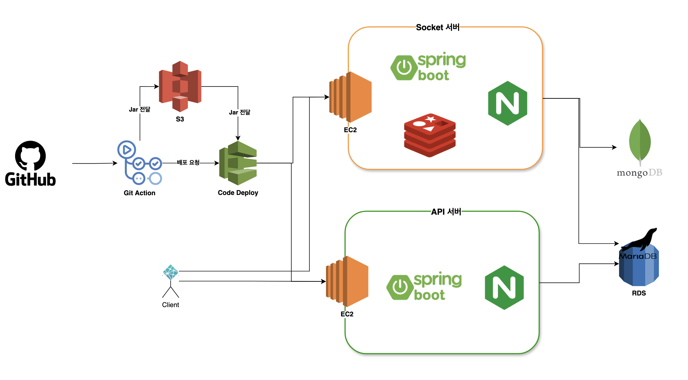
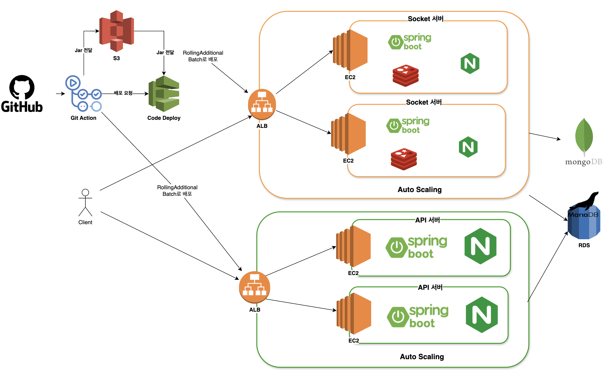
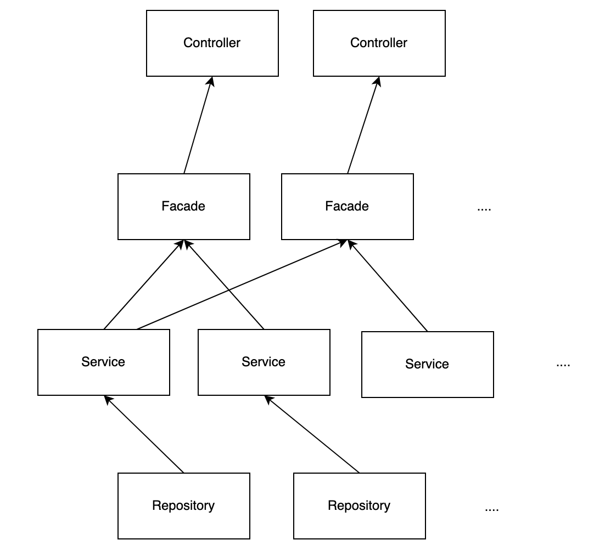
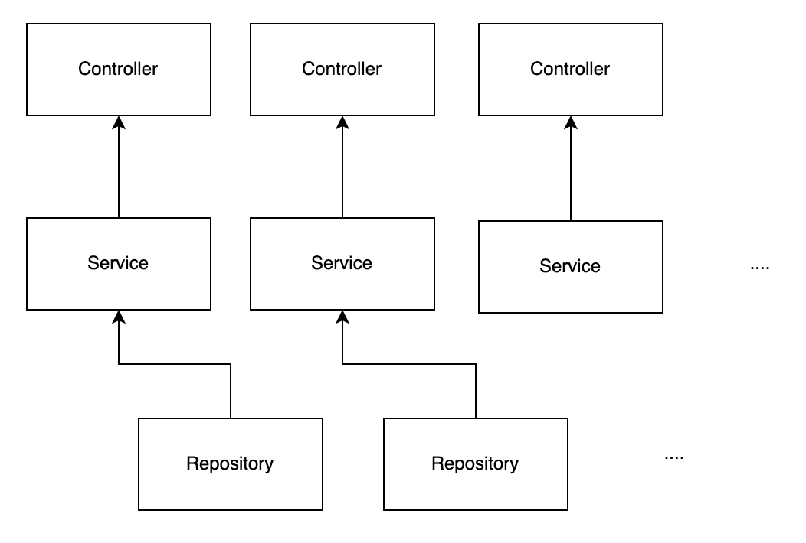

# 보고!(BoardGo)🎲 서비스 Backend README

# 🔍서비스 소개

보고!(BoardGo) 서비스는 보드게임를 좋아하는 사람들이 오프라인으로 만날 수 있도록 소통 공간을 만들어주는 서비스 입니다.  
사용자들은 직접 보드게임과 장소를 선택 해 모임을 생성하고, 별도의 연락망을 사용하지 않아도 보고 서비스 내에서 채팅방을 통해 소통할 수 있도록 편리성을 제공 해 줍니다. 또한, 보드게임에 익숙하지 않은
분들을 위해 1000여 개의 보드게임을 장르별, 상황별로 검색할 수 있습니다.

## 서비스 기획 이유

보드게임은 소수 보다 다수로 진행하는 게임이 많기 때문에 많은 사람들이 커뮤니티와 SNS 등을 통해 보드게임을 함께할 인원을 모집하고 보드게임을 즐기곤 합니다.  
따라서 보드게임 커뮤니티에서 빠르게 내 주변의 보드게임 모임에 참가하고, 다양한 보드게임을 경험할 수 있다면 더 많은 사람들이 보드게임을 손쉽게 접할 수 있을것 이라고 생각했습니다.
여러명과 보드게임을 즐기고 싶은 사람, 보드게임을 좋아하는 사람, 빠르게 보드게임 모임에 참여하고 싶은 사람을 타겟팅하여 보드게임에 특화된 모임 서비스를 기획했습니다.

## 서비스 주요 기능

- 모임 생성 및 모임 참여하기
- 상황별 보드게임/마감임박 모임/신규 모임
- 보드게임을 함께한 사람들에게 리뷰 남기기
- 사용자의 리뷰를 한 눈에 볼 수 있는 프로필
- 모임 참여자 간 대화를 할 수 있는 채팅방

---

# 🔍기술 스택

### Environment

### Config

### Development

### Communication

### Infra

# 🔍아키텍처 설계

## 개발 서버 아키텍처

## 운영 서버 아키텍처

# 🔍ERD

| `보드게임`                                                                                       
|----------------------------------------------------------------------------------------------|
|  

| `모임`                                                                                       
|--------------------------------------------------------------------------------------------|
|  

| `채팅`                                                                                       
|--------------------------------------------------------------------------------------------|
|  

| `알림`                                                                                       
|--------------------------------------------------------------------------------------------|
|  

| `리뷰`                                                                                       
|--------------------------------------------------------------------------------------------|
|  

| `회원`                                                                                       
|--------------------------------------------------------------------------------------------|
|  

| `약관동의`                                                                                   
|------------------------------------------------------------------------------------------|
|  

# 🔍계층 아키텍처 의존관계

| 퍼사드 패턴 사용 시                      | 서비스만 사용 시 (같은 도메인 비즈니스 로직만 필요할 경우)      
|----------------------------------|-----------------------------------------|
|  |  

# 🔍Git Flow

| **브랜치**   | **특징**                                                                                                                                                   |
|-----------|----------------------------------------------------------------------------------------------------------------------------------------------------------|
| `prod`    | - 운영 서버   - `prod/1.0` `prod/2.1`                                                                                                                    |
| `dev`     | - 개발 서버 & 테스트서버   - `prod` 브랜치에서 분기   - `prod` 브랜치에서 `hoxfix` 발생 후 `prod`에 merge 됐을 경우, `prod > dev` pull 동기화                                    |
| `feature` | - 하나의 CRUD 단위로 개발   - `dev` 브랜치에서 분기   - 기능 개발 완료 시 `dev` 브랜치로 merge   - `feature/기능명` (feature/user-board)   - feature 기능명의 네이밍은 케밥 케이스 |
| `fix`     | - `dev` 브랜치에서 이슈 발생 시 `dev` 브랜치에서 분기   - 이슈 수정 완료 시 `dev` 브랜치로 merge                                                                                 |
| `hotfix`  | - `prod` 브랜치에서 이슈 발생 시 분기   - 이슈 해결 시 `prod` 브랜치에 merge   - 현재 운영이 `prod/1.0`이고, `hotfix/1.0` 에서 해결한 경우 prod의 다음버전인  `prod/1.1` 에 merge          |

*[🪴Branch Convention](https://github.com/LuckyVicky-2team/backend/wiki/%F0%9F%AA%B4Branch-Convention) 참조

# 🔍백엔드 팀원 소개

| **팀원**                                                                                                                                                                         | **서비스 개발 담당 기능**                                                              | **이슈 및 해결과정** |
|--------------------------------------------------------------------------------------------------------------------------------------------------------------------------------|-------------------------------------------------------------------------------|---------------|
|    **이예진([@yeahdy](https://github.com/yeahdy))**     | - 소셜 회원   - 약관동의   - 메인 홈   - 모임 상호작용   - 회원 마이페이지   - 리뷰 |               |
|    **양지원([@ambosing](https://github.com/ambosing))** | - 일반회원   - 모임   - 보드게임   - 찜하기   - 쓰레드 형식 채팅                  |               |

